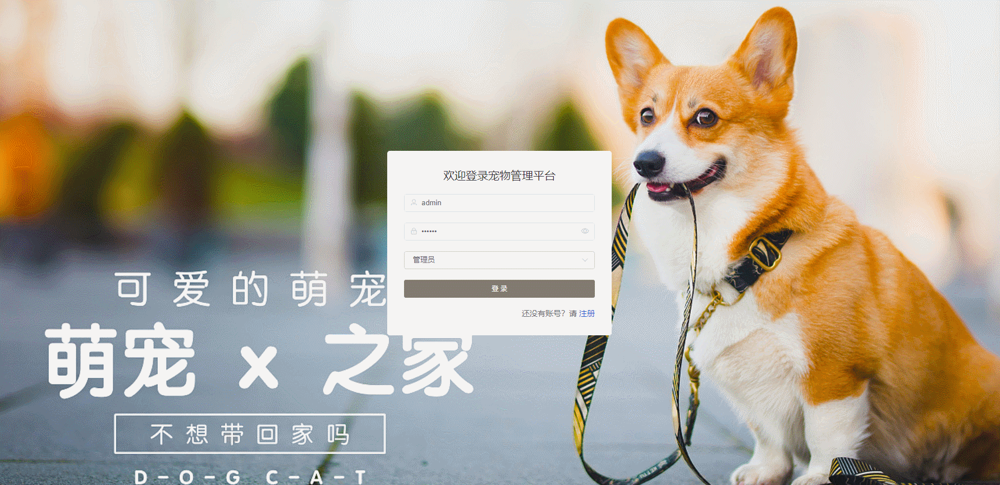

#  pet🎂

基于SpringBoot+Vue的宠物领养平台

## 介绍🌞

> 基于SpringBoot+Vue的宠物领养平台采用B/S（浏览器/服务器）架构，通过前后端分离的开发模式，实现了宠物领养、救助、管理等功能的一体化。后端采用SpringBoot框架，前端则使用Vue.js框架，数据库选用MySQL，确保了系统的稳定性和可扩展性。

## 项目演示🌞

> 管理端



> 用户端


## 安装教程🌞

```
1. 运行环境准备mysql8 + java8 + node14.16.1

2. 配置maven路径，加载依赖

3. 运行sql文件，确保application.yml或config.properties的数据库名称和账号密码是数据库所在主机的账号密码
```


## 使用说明🌞

```
1. 登入

	管理员账号：admin 密码：123456

	客户账号：user 密码：123456
  
2. 运行流程

SpringBoot+Vue项目的部署详情可以查看这篇CSDN博客：http://t.csdnimg.cn/kpuxS

前后端不分离项目的部署流程可以查看这篇CSDN博客：http://t.csdnimg.cn/CslA5
```


## CSDN项目合集🌞

点击前往：http://t.csdnimg.cn/Q4u84


## 联系我🌞

**有偿获取完整源码或调试代码**

🐧：1902317191

wx：coding1902317191


